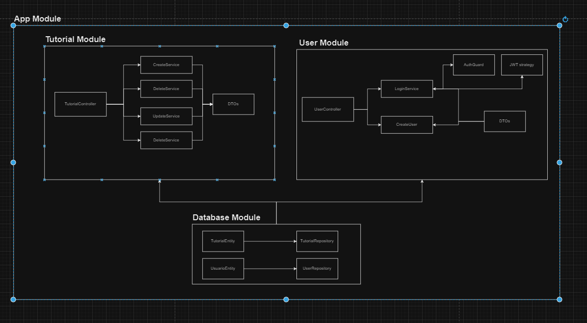

# Projeto Tutorial

Este projeto é uma aplicação NestJS que gerencia tutoriais e usuários, com autenticação, CRUD de tutoriais, e listagem paginada. A aplicação utiliza TypeORM para interagir com um banco de dados MySQL e Swagger para documentação da API.

## Sumário

- [Estrutura do Projeto](#estrutura-do-projeto)
- [Configuração do Ambiente](#configuração-do-ambiente)
- [Documentação da API](#documentação-da-api)
- [Design Patterns e Arquitetura](#design-patterns-e-arquitetura)
- [Escalabilidade](#escalabilidade)
- [Instalação](#instalação)
- [Licença](#licença)

## Estrutura do Projeto

- [Escalabilidade](#escalabilidade)
- [Instalação](#instalação)
- [Licença](#licença)

## Estrutura do Projeto

O projeto é estruturado da seguinte forma:

- **src/**
  - **auth/**: Contém a lógica de autenticação e autorização.
  - **users/**: Gerencia as operações relacionadas aos usuários.
  - **tutorial/**: Gerencia as operações relacionadas aos tutoriais.
  - **config/**: Contém a configuração do TypeORM e outras configurações do projeto.
  - **utils/**: Utilitários e funções auxiliares.
  - **main.ts**: Ponto de entrada da aplicação.
  - **app.module.ts**: Módulo principal da aplicação.




### Variáveis de Ambiente

Crie um arquivo `.env` na raiz do projeto com as seguintes variáveis:

```env
DATABASE_TYPE=mysql
DATABASE_HOST=localhost
DATABASE_PORT=3306
DATABASE_USERNAME=user
DATABASE_PASSWORD=password
DATABASE_NAME=tutorialusers
```

# Documentação da API
## Acesso à Documentação

A documentação da API está disponível no Swagger. Após iniciar o servidor, acesse:

[http://localhost:3000/api](http://localhost:3000/api)

## Autenticação no Swagger

Para usar a autenticação via Bearer Token no Swagger:

1. Clique em "Authorize" no canto superior direito da interface do Swagger.
2. Insira o token de autenticação no formato `Bearer <seu-token>` e clique em "Authorize".
3. Feche a janela de autorização.

## Design Patterns e Arquitetura

### Design Patterns

- **Repository Pattern**: Usado para encapsular a lógica de acesso a dados e fornecer uma interface mais limpa.
- **Service Pattern**: Separa a lógica de negócios em serviços para melhor modularidade e teste.

### Arquitetura

- **Modularidade**: O projeto é dividido em módulos (auth, users, tutorial), cada um responsável por uma parte específica da aplicação.
- **Injeção de Dependências**: Utiliza a injeção de dependências para gerenciar serviços e repositórios.

## Escalabilidade

O projeto é escalável devido à sua arquitetura modular e ao uso de padrões de design que permitem adicionar novos recursos e serviços com facilidade. A utilização do TypeORM e a configuração via variáveis de ambiente facilitam a adaptação a diferentes ambientes e requisitos de banco de dados.
